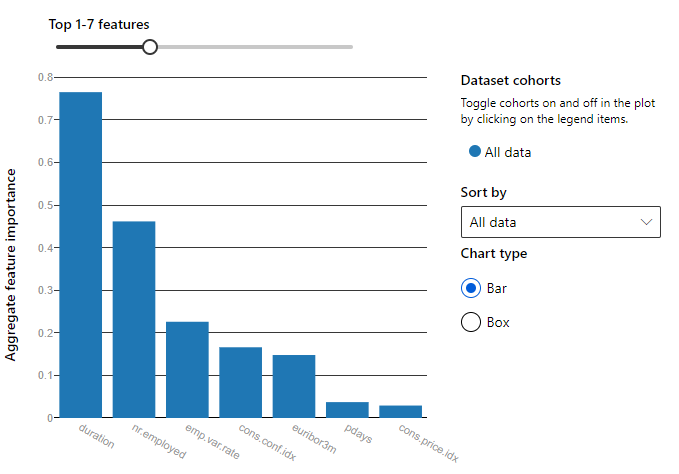

# Optimizing an ML Pipeline in Azure

## Overview
This project is part of the Udacity Azure ML Nanodegree.
In this project, we build and optimize an Azure ML pipeline using the Python SDK and a provided Scikit-learn model.
This model is then compared to an Azure AutoML run.

## Summary
Bank Marketing dataset is collected from direct marketing campaign of a bank institution from Portuguese. 
Marketing campaign can be understood as phone calls to the clients to convince them accept to make a term deposit with their bank. 
After each call, they are being noted as to “no = 0” - being the client did not make a deposit and “yes = 1” - being the client on call accepted to make a deposit. 
The purpose of this project is to train the dataset by using two different methods: 
the first one is using sklearn model that is tuned by HyperDrive and the second one is finding the optimum model by using AutoML then compare the result of these two methods.

## Scikit-learn Pipeline

Steps involved in the entry script(train.py):
Creation of TabularDataset using TabularDatasetFactory. Find dataset here
Cleaning the data - removing rows with missing entries, one hot encoding the categorical data, feature engineering etc.
Splitting the data into train and test sets.
Training the logistic regression model using arguments from the HyperDrive runs.
Calculating the accuracy score.

Steps involved in the project notebook(udacity-project.ipynb):
Assigning a compute cluster to be used as the target.
Specifying the parameter sampler(we defined the hyperparameter space using RandomParameterSampling method and tuned C and max_iter parameters. We used random sampling (choice) to try different sets of hyperparameters to maximize our primary metric, Accuracy.)
Specifying an early termination policy(BanditPolicy - it'll be passed later by hyperDrive).
Creating a SKLearn estimator for use with train.py (using SKlearn object and pass the following parameters: source_directory, entry_script and compute_target details)
Creating a HyperDriveConfig using the estimator, hyperparameter sampler, and policy.
Submitting the hyperdrive run to the experiment and showing run details with the widget.
Getting the best run id and saving the model from that run.
Saving the model under the workspace for deployment.
Creation of TabularDataset using TabularDatasetFactory from the provided URL in the notebook
Splitting the data into train and test sets.
Set up AutoML configuration with list of parameters: task, primary_metric,training_data,label_column_name,n_cross_validations and (enable_onnx_compatible_models - to export the best model later).
Submit the AutoML run and save the best model

What are the benefits of the parameter sampler you chose? 
It is important to choose the right parameter sampling method as it plays a major role on your run time. 
Parameter sampling searches the hyperparameter space defined for your model and selects the best values of a particular hyperparameter. 
Azure can support three types of parameter sampling; Random sampling, Grid sampling and Bayesian sampling. 
Random Parameter Sampling deals with discrete and continous hyperparameters, where the values are chosen randomly, thus saving a lot of computational efforts. 
Random sampling can be used as a starting sampling method to do an initial search and then improve the search with other sampling methods.

What are the benefits of the early stopping policy you chose? 
When the run becomes exhaustive, an early termination policy can become quite helpful as it ensures that we don't keep running the experiment for long periods of time and end up wasting resources and time, 
in order to find what the optimal parameter is. A run is cancelled when the criteria of a specified policy are met. There are several early termination policies that can be used such as; Bandit Policy, 
Median Stopping Policy and Truncation Selection Policy . Bandit Policy was used in our project as the early termination policy. 
This policy is based on the slack factor and delay evaluation. It basically checks the job assigned after every 'n' number of iterations (n is passed as an argument). 
If the primary metric falls out of the slack factor, Azure ML terminates the job.

## AutoML
Since it was a classification task, the primary metric that was to be maximized was set to 'accuracy'. We provided the cleaned version of the dataset. 
The model was trained remotely on the compute cluster created in the beginning and number of iterations was set to a small value(20 in this project)

## Pipeline comparison
hough both the models used automated machine learning somehow, a slight difference in the accuracies was visible, with model trained using AutoML gave slightly better results. The AutoML model gave best accuracy of 0.9168 with VotingEnsemble, 
while the model built using SKLearn and HyperDrive gave a slightly lower score of 0.9116.The SKlearn model took 17 minutes to complete the job, while the AutoML model was iterated 19 times within two 30 minutes.

Feature importance for VotingEnsemble has shown below. There are three most important features for the model, which are duration, nr.employeed and emp.var.rate.
Feature importance is very important for tree based model, it shows how the model understands the dataset and make prediction base on it.

## Future work
Improving the training data might give better results such us removing the class imbalance that we have in coulmn 'Y' where the number of yes(1) is very low in comparison to no(0). We can also tune some other hyperparameters used in the model and use the pipelines suggested by the AutoML models in order to achieve better results in the future.
Using different parameter sampling techniques and tuning the arguments of the BanditPolicy can also prove fruitful.

## Proof of cluster clean up
Computetarget deleted
